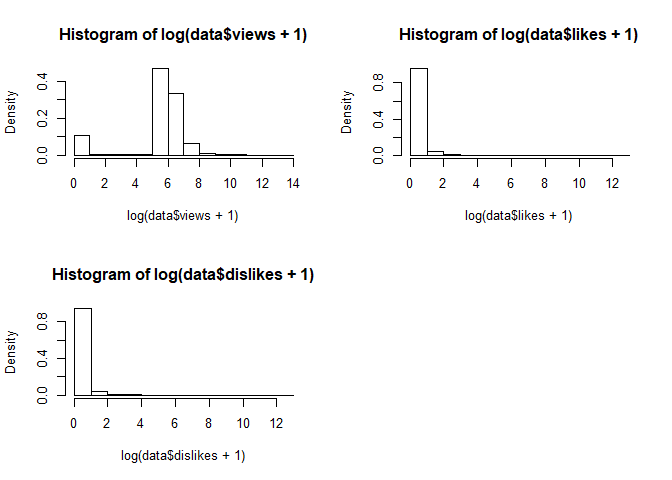

# Какое это распределение?

### Подгрузим данные


```r
data <- read.csv(file = "engagement.csv")
summary(data)
```

```
##        id             views              likes             dislikes       
##  Min.   :  5038   Min.   :     0.0   Min.   :     0.0   Min.   :     0.0  
##  1st Qu.: 29071   1st Qu.:   189.0   1st Qu.:     0.0   1st Qu.:     0.0  
##  Median : 61246   Median :   326.0   Median :     0.0   Median :     0.0  
##  Mean   : 59782   Mean   :   717.5   Mean   :     5.1   Mean   :     9.2  
##  3rd Qu.: 88417   3rd Qu.:   665.0   3rd Qu.:     0.0   3rd Qu.:     0.0  
##  Max.   :113136   Max.   :806103.0   Max.   :330826.0   Max.   :371683.0
```

```r
str(data)
```

```
## 'data.frame':	88648 obs. of  4 variables:
##  $ id      : int  5038 5039 5040 5041 5042 5043 5044 5045 5046 5047 ...
##  $ views   : int  332 442 390 340 272 247 246 259 262 428 ...
##  $ likes   : int  0 0 0 0 0 0 0 0 0 0 ...
##  $ dislikes: int  0 0 0 0 0 0 0 0 0 0 ...
```

### Исходные соображения
* Поскольку это данные о просмотрах, лайках, дислайках - они, чаще всего, распределены логнормально. При такой вариации, чтобы смотреть на гистограммы - стоит сразу логарифмировать :)
Видно также, что лайки и дислайки - редкое явление.

# Графический анализ

### Гистограммы плотности распределения


```r
par(mfrow=c(2,2))
hist(data$views, freq=FALSE)
hist(data$likes, freq=FALSE)
hist(data$dislikes, freq=FALSE)
par(mfrow=c(2,2))
```

<!-- -->

```r
hist(log(data$views+1), freq=FALSE)
hist(log(data$likes+1), freq=FALSE)
hist(log(data$dislikes+1), freq=FALSE)
```

<!-- -->

### Ящички с усам и диаграммки расссеяния


```r
par(mfrow=c(2,2))
boxplot(log(data$views+1))
boxplot(log(data$likes+1))
boxplot(log(data$dislikes+1))
```

<!-- -->


```r
par(mfrow=c(2,2))
plot(data$id, log(data$views+1), pch=20)
plot(data$id, log(data$likes+1), pch=20)
plot(data$id, log(data$dislikes+1), pch=20)
```

<!-- -->

* Графический анализ показывает, что объекты продуцирующие эти просмотры и лайки явно отличаются между друг-другом и могут быть сгруппированы в кластеры.

# Подбор распределения для views


```r
set.seed(48)
views <- sample(data$views, length(data$views)*0.1)
```


```r
#hist(views)
descdist(views, boot = 500)
```

<!-- -->

```
## summary statistics
## ------
## min:  0   max:  174582 
## median:  325 
## mean:  715.5527 
## estimated sd:  3432.931 
## estimated skewness:  24.78859 
## estimated kurtosis:  923.9742
```

```r
plotdist(views, histo = TRUE, demp = TRUE)
```

<!-- -->

* Понамешано чего-то...диаграмма намекает на аутлаеры. Стоит протестировать Вейбулла, логнормальное и гамму.


```r
d <- (views+1)/10 #некоторые преобразования
fit_w  <- fitdist(d, "weibull")
```

```
## $start.arg
## $start.arg$shape
## [1] 0.5814977
## 
## $start.arg$scale
## [1] 56.81123
## 
## 
## $fix.arg
## NULL
```

```r
fit_ln <- fitdist(d, "lnorm")
```

```
## $start.arg
## $start.arg$meanlog
## [1] 3.056067
## 
## $start.arg$sdlog
## [1] 2.06352
## 
## 
## $fix.arg
## NULL
```

```r
fit_g <- fitdist(d, "gamma")
```

```
## $start.arg
## $start.arg$shape
## [1] 0.04357275
## 
## $start.arg$rate
## [1] 0.0006080886
## 
## 
## $fix.arg
## NULL
```

```r
summary(fit_ln)
```

```
## Fitting of the distribution ' lnorm ' by maximum likelihood 
## Parameters : 
##         estimate Std. Error
## meanlog 3.056067 0.02191764
## sdlog   2.063520 0.01549810
## Loglikelihood:  -46087.65   AIC:  92179.3   BIC:  92193.48 
## Correlation matrix:
##         meanlog sdlog
## meanlog       1     0
## sdlog         0     1
```

```r
summary(fit_w)
```

```
## Fitting of the distribution ' weibull ' by maximum likelihood 
## Parameters : 
##         estimate  Std. Error
## shape  0.6674911 0.004960862
## scale 49.0007147 0.816140408
## Loglikelihood:  -44480.87   AIC:  88965.74   BIC:  88979.92 
## Correlation matrix:
##           shape     scale
## shape 1.0000000 0.2953155
## scale 0.2953155 1.0000000
```

```r
summary(fit_g)
```

```
## Fitting of the distribution ' gamma ' by maximum likelihood 
## Parameters : 
##          estimate   Std. Error
## shape 0.519398778 0.0064039521
## rate  0.007250324 0.0001358665
## Loglikelihood:  -45050.25   AIC:  90104.5   BIC:  90118.68 
## Correlation matrix:
##           shape      rate
## shape 1.0000000 0.6366437
## rate  0.6366437 1.0000000
```

* По информационным критериям Вейбулл будто бы подходит лучше :)


```r
par(mfrow=c(2,2))
plot.legend <- c("weibull", "lognormal", "gamma")
denscomp(list(fit_w, fit_ln, fit_g), legendtext = plot.legend)
cdfcomp (list(fit_w, fit_ln, fit_g), xlogscale = TRUE, legendtext = plot.legend)
qqcomp  (list(fit_w, fit_ln, fit_g), xlogscale = TRUE, ylogscale = TRUE, legendtext = plot.legend)
ppcomp  (list(fit_w, fit_ln, fit_g), legendtext = plot.legend)
```

<!-- -->

* Всё очень плохо :)

# Статистические критерии


```r
gofstat(list(fit_ln, fit_w, fit_g), fitnames = c("lnorm", "weibull", "gamma"))
```

```
## Goodness-of-fit statistics
##                                     lnorm    weibull      gamma
## Kolmogorov-Smirnov statistic    0.3264533  0.2585705  0.2347403
## Cramer-von Mises statistic    176.5853766 92.5767298 91.0732994
## Anderson-Darling statistic   1014.5983293        Inf        Inf
## 
## Goodness-of-fit criteria
##                                   lnorm  weibull    gamma
## Akaike's Information Criterion 92179.30 88965.74 90104.50
## Bayesian Information Criterion 92193.48 88979.92 90118.68
```

```r
#посмотрим Колмогорова-Смирнова на данных (не самый мощный и не самый красивый..)
paste("ks.test weibull", ks.test(d, "pweibull", shape = fit_w$estimate[1], scale = fit_w$estimate[2])$p.value)
```

```
## [1] "ks.test weibull 0"
```

```r
paste("ks.test gamma", ks.test(d, "pgamma", shape = fit_g$estimate[1], scale = fit_g$estimate[2])$p.value)
```

```
## [1] "ks.test gamma 0"
```

```r
paste("ks.test lnorm", ks.test(log(d), "pnorm")$p.value)
```

```
## [1] "ks.test lnorm 0"
```

```

* Всё ещё очень плохо :)

* Остальные даже смотреть не хочу :)
  

.
