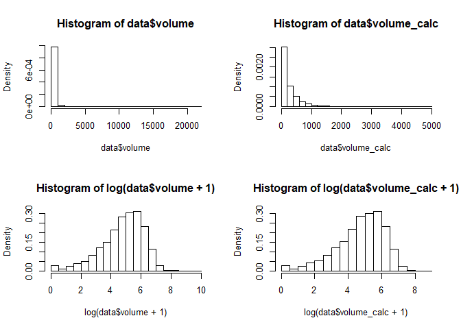
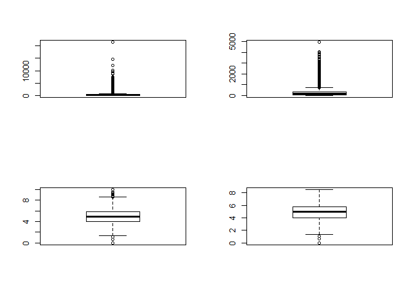
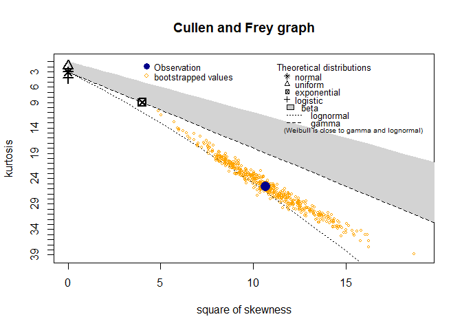
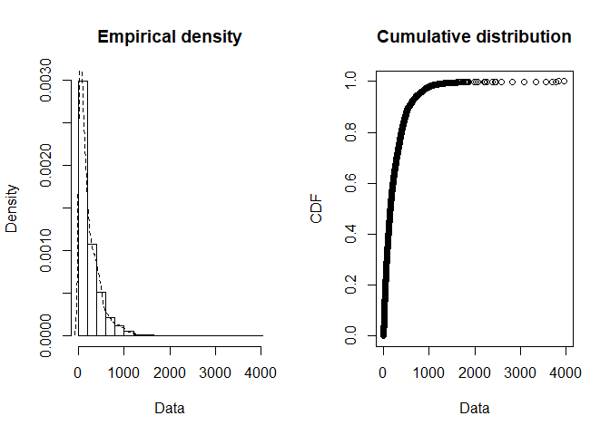
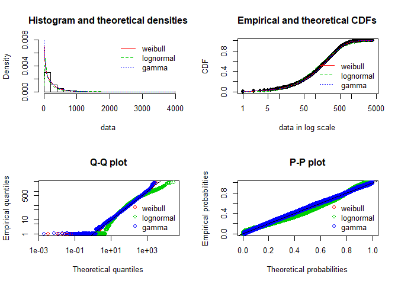

# Найти выбросы?

### Подгрузим данные


```r
data <- read.csv(file = "traffic_sample.csv")
summary(data)
```

```
##      volume         volume_calc    
##  Min.   :    0.0   Min.   :   0.0  
##  1st Qu.:   52.0   1st Qu.:  52.0  
##  Median :  146.0   Median : 144.0  
##  Mean   :  241.7   Mean   : 235.1  
##  3rd Qu.:  336.0   3rd Qu.: 332.0  
##  Max.   :21506.0   Max.   :4925.0
```

```r
str(data)
```

```
## 'data.frame':	100000 obs. of  2 variables:
##  $ volume     : num  12 234 26 20 42 242 206 20 41 222 ...
##  $ volume_calc: num  10 230 26 16 42 242 204 20 41 222 ...
```

### Исходные соображения
* Исходные данные скорее всего логнормальные.

## Графический анализ

### Гистограммы плотности распределения, ящички с усами


```r
par(mfrow=c(2,2))
hist(data$volume, freq=FALSE)
hist(data$volume_calc, freq=FALSE)
hist(log(data$volume+1), freq=FALSE)
hist(log(data$volume_calc+1), freq=FALSE)
```

<!-- -->

```r
boxplot(data$volume)
boxplot(data$volume_calc)
boxplot(log(data$volume+1))
boxplot(log(data$volume_calc+1))
```

<!-- -->

## Baseline-стратегия
0) Можно, наверное, в лоб заменить все значения, для некоторого фиксированного порога разницы volume и volume_calc на какие-нибудь линейные преобразования..но мы поступим иначе.
1) Подобрем закон распределения к данным
2) Выбрем доверительный интервал/трешхолд
3) Заменим пустыми значения выходящие за пределы доверительного интервала

## Подбор распределения для views


```r
set.seed(48)
volume <- sample(data$volume, length(data$volume)*0.1)
```


```r
descdist(volume, boot = 500)
```

<!-- -->

```
## summary statistics
## ------
## min:  0   max:  3954 
## median:  147 
## mean:  237.4334 
## estimated sd:  277.0169 
## estimated skewness:  3.266383 
## estimated kurtosis:  25.52442
```

```r
plotdist(volume, histo = TRUE, demp = TRUE , xlogscale = TRUE, ylogscale = TRUE)
```

<!-- -->

* Красиво..


```r
d <- (volume+1) #некоторые преобразования
fit_w  <- fitdist(d, "weibull")
```

```
## $start.arg
## $start.arg$shape
## [1] 0.8466472
## 
## $start.arg$scale
## [1] 231.2699
## 
## 
## $fix.arg
## NULL
```

```r
fit_ln <- fitdist(d, "lnorm")
```

```
## $start.arg
## $start.arg$meanlog
## [1] 4.76798
## 
## $start.arg$sdlog
## [1] 1.417285
## 
## 
## $fix.arg
## NULL
```

```r
fit_g <- fitdist(d, "gamma")
```

```
## $start.arg
## $start.arg$shape
## [1] 0.7409095
## 
## $start.arg$rate
## [1] 0.003107407
## 
## 
## $fix.arg
## NULL
```

```r
summary(fit_ln)
```

```
## Fitting of the distribution ' lnorm ' by maximum likelihood 
## Parameters : 
##         estimate Std. Error
## meanlog 4.767980 0.01417285
## sdlog   1.417285 0.01002169
## Loglikelihood:  -65356.61   AIC:  130717.2   BIC:  130731.6 
## Correlation matrix:
##         meanlog sdlog
## meanlog       1     0
## sdlog         0     1
```

```r
summary(fit_w)
```

```
## Fitting of the distribution ' weibull ' by maximum likelihood 
## Parameters : 
##          estimate  Std. Error
## shape   0.8877993 0.006896918
## scale 224.7832597 2.667039343
## Loglikelihood:  -64615.14   AIC:  129234.3   BIC:  129248.7 
## Correlation matrix:
##           shape     scale
## shape 1.0000000 0.3142077
## scale 0.3142077 1.0000000
```

```r
summary(fit_g)
```

```
## Fitting of the distribution ' gamma ' by maximum likelihood 
## Parameters : 
##          estimate   Std. Error
## shape 0.835815835 9.517841e-03
## rate  0.003505896 4.865987e-05
## Loglikelihood:  -64628.14   AIC:  129260.3   BIC:  129274.7 
## Correlation matrix:
##           shape      rate
## shape 1.0000000 0.6975646
## rate  0.6975646 1.0000000
```

* По информационным критериям Вейбулл подходит лучше :)


```r
par(mfrow=c(2,2))
plot.legend <- c("weibull", "lognormal", "gamma")
denscomp(list(fit_w, fit_ln, fit_g), legendtext = plot.legend)
cdfcomp (list(fit_w, fit_ln, fit_g), xlogscale = TRUE, legendtext = plot.legend)
qqcomp  (list(fit_w, fit_ln, fit_g), xlogscale = TRUE, ylogscale = TRUE, legendtext = plot.legend)
ppcomp  (list(fit_w, fit_ln, fit_g), legendtext = plot.legend)
```

<!-- -->

* Если не брать во внимание выбросы, то Вейбул лёг как родной :)

## Статистический критерий

* Критерий Колмогорова-Смирнова не самый мощный...


```r
gofstat(list(fit_ln, fit_w, fit_g), fitnames = c("lnorm", "weibull", "gamma"))
```

```
## Goodness-of-fit statistics
##                                     lnorm    weibull      gamma
## Kolmogorov-Smirnov statistic   0.07466582 0.01349318 0.01416827
## Cramer-von Mises statistic    19.11678362 0.26446019 0.38206568
## Anderson-Darling statistic   120.70102446 2.12587646 2.63439526
## 
## Goodness-of-fit criteria
##                                   lnorm  weibull    gamma
## Akaike's Information Criterion 130717.2 129234.3 129260.3
## Bayesian Information Criterion 130731.6 129248.7 129274.7
```

```r
#посмотрим Колмогорова-Смирнова на данных (не самый мощный и не самый красивый..)
paste("ks.test weibull", ks.test(d, "pweibull", shape = fit_w$estimate[1], scale = fit_w$estimate[2])$p.value)
```

```
## [1] "ks.test weibull 0.052434669179395"
```

```r
paste("ks.test gamma", ks.test(d, "pgamma", shape = fit_g$estimate[1], scale = fit_g$estimate[2])$p.value)
```

```
## [1] "ks.test gamma 0"
```

```r
paste("ks.test lnorm", ks.test(log(d), "pnorm")$p.value)
```

```
## [1] "ks.test lnorm 0"
```

* Ну, Вейбулл на грани, берем его :)


```r
#Уточним параметры
b <- bootdist(fit_w, bootmethod="nonparam", niter=500) 
b <- summary(b)
b
```

```
## Nonparametric bootstrap medians and 95% percentile CI 
##            Median        2.5%       97.5%
## shape   0.8879754   0.8739588   0.9020444
## scale 224.7196978 219.3236787 230.1730625
```

## Определим оутлаеры


```r
diff = data$volume - data$volume_calc
print(paste0("Всего кандидатов на удаление: ",
  length(diff[diff > 0]),
  ", в хвостах Boxplot-а: ",
            length(boxplot.stats(log(data$volume_calc))$out)))
```

```
## [1] "Всего кандидатов на удаление: 22917, в хвостах Boxplot-а: 3134"
```

```r
#qh = qweibull(0.975, shape = median(sapply(b$estim[1], as.numeric)), 
#            scale = median(sapply(b$estim[2], as.numeric)), log = FALSE)
#ql = qweibull(0.025, shape = median(sapply(b$estim[1], as.numeric)), 
#            scale = median(sapply(b$estim[2], as.numeric)), log = FALSE)

#print(paste("В хвостах нашего распределения:",
#  length(data$volume_calc[data$volume_calc < ql | data$volume_calc < qh])))

outliers = dweibull(data$volume_calc, shape = median(sapply(b$estim[1], as.numeric)), 
            scale = median(sapply(b$estim[2], as.numeric)), log = FALSE)

print(paste("Оутлаеров среди них:",
  length(outliers[outliers < 5*10^-5])))
```

```
## [1] "Оутлаеров среди них: 1302"
```


.
